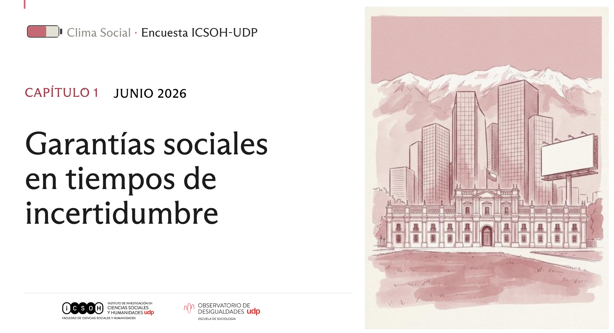
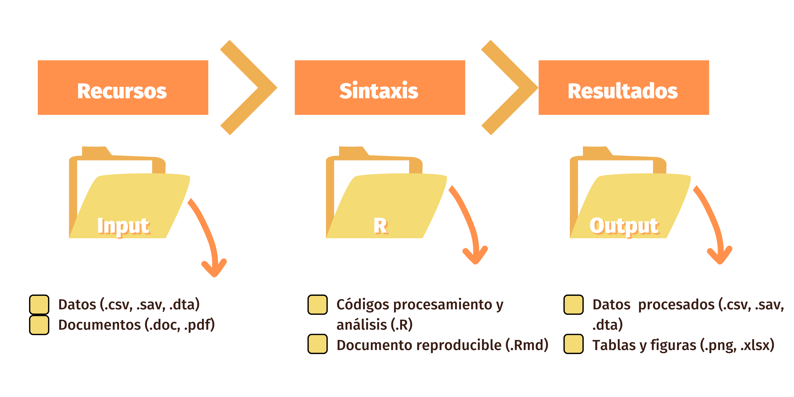
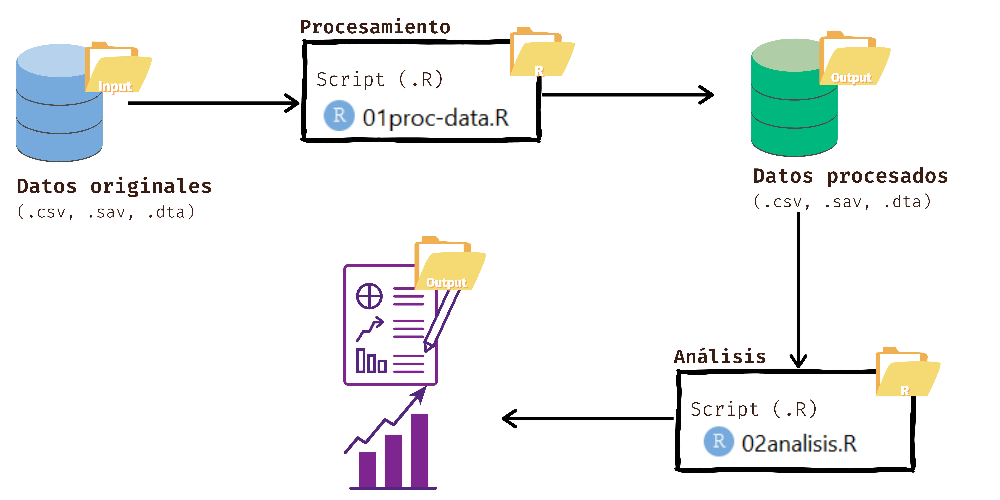
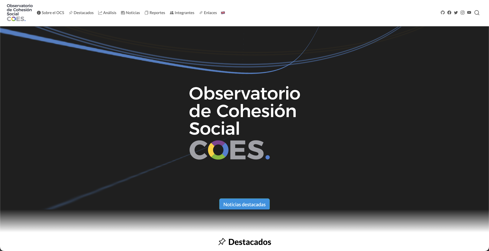
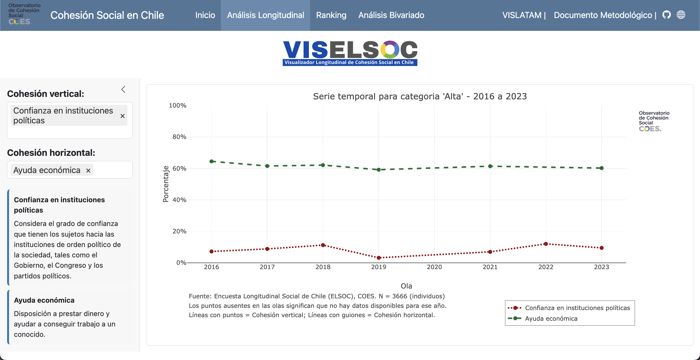
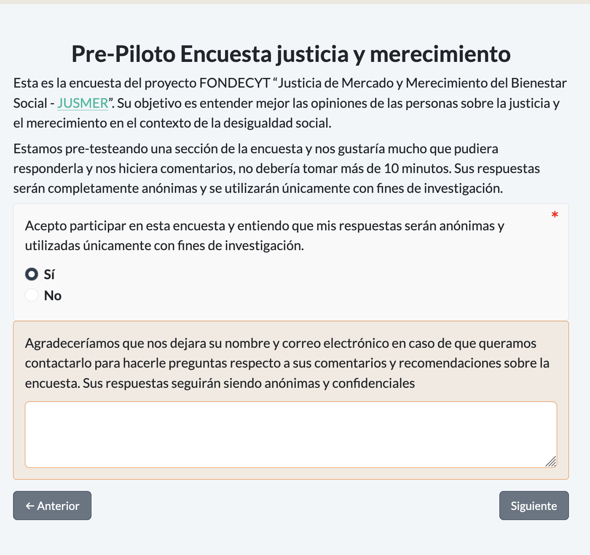
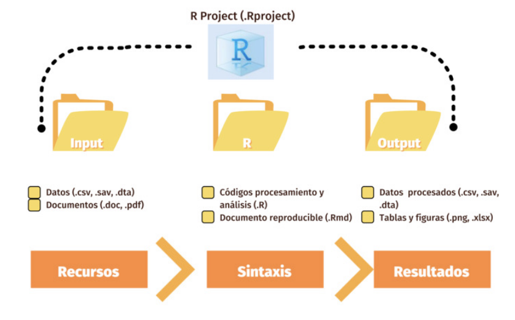
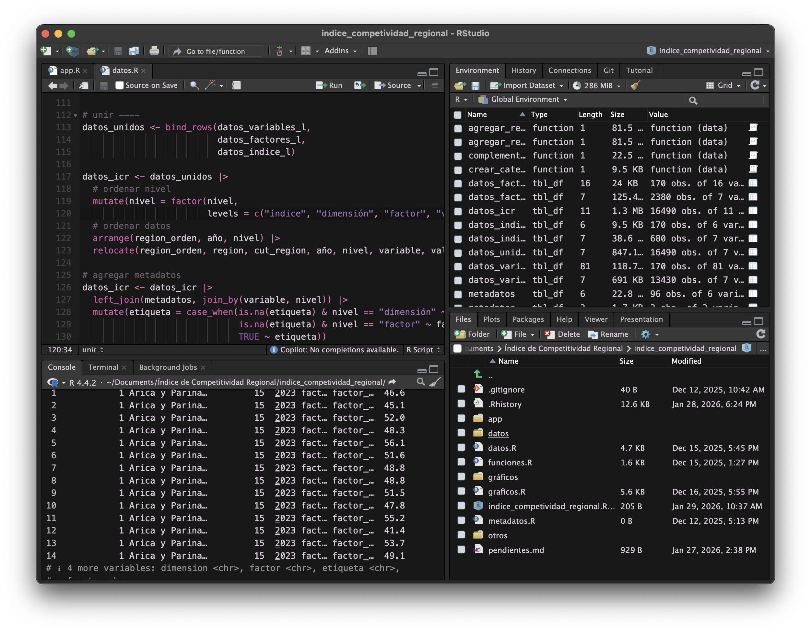
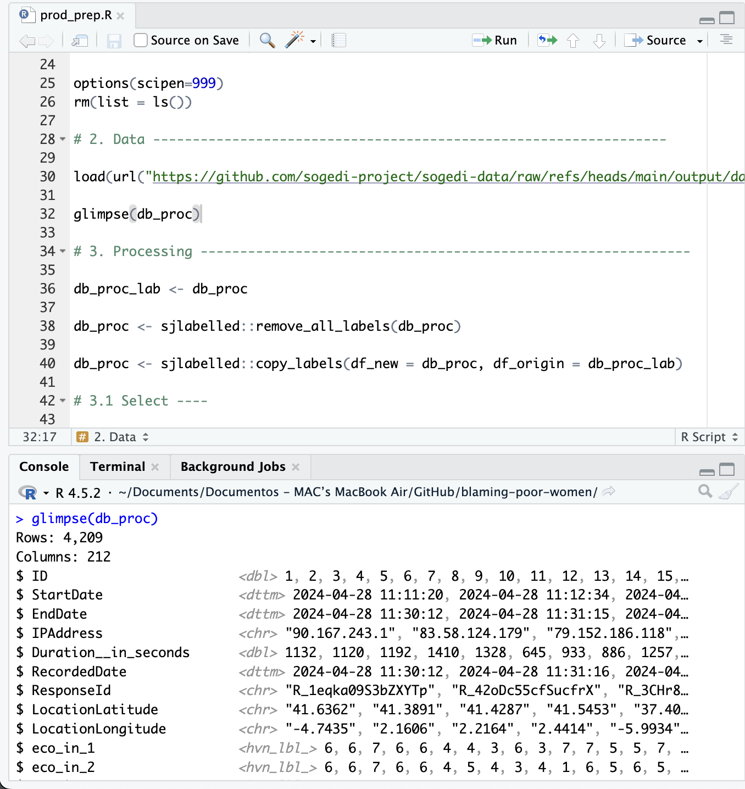
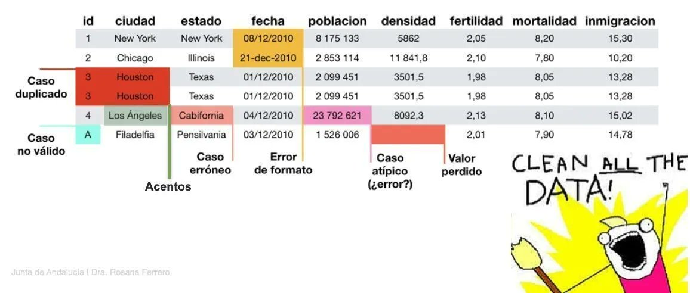

```{r}
#| include: false
pacman::p_load(dplyr, ggplot2, sjlabelled, sjmisc, sjPlot, psych)
load("../input/data/BBDD_Clima_Junio_Sample.RData")
datos <- sjlabelled::as_label(bbdd_clima_sample)
```

## Objetivo del taller 🎯

. . .

- Darles las primeras herramientas para **programar en R** aplicado al **análisis de datos en ciencias sociales**. Vamos a trabajar con una versión de la **Encuesta ICSOH-UDP**, un instrumento de opinión pública que mide el clima social y político en Chile.

. . .

- Al terminar, ustedes van a poder cargar una base de datos, explorarla, recodificarla, y producir sus primeros análisis descriptivos, todo con código que puedan repetir y adaptar.

::: {.fragment .pad}

- **Primer bloque**: presentación
- **Segundo bloque**: práctico

Vamos a trabajar en **Posit Cloud**, directo desde el navegador y sin instalar nada. Los detalles de acceso están en la **Guía 1** que se envió antes del taller.
:::

----

### Lo que sí vamos a ver 👁️

::: {.incremental}
1. **Qué es R y cómo se usa junto a RStudio**
2. **Los elementos básicos del lenguaje de R**
3. **Herramientas para cargar, ordenar y procesar datos de encuestas**
4. **Herramientas para realizar estadísticas descriptivas**
:::

----

### Lo que no vamos a ver 

::: {.incremental}
- Cómo instalar R y RStudio en tu computador: como trabajamos en **Posit Cloud**, hoy no hace falta instalar nada; si igual quieres instalarlo en tu computador, la guía está en la **Guía 1**
- Cómo escribir tus propias funciones o loops
- Modelos estadísticos complejos (p. ej. regresiones)
:::

::: {.fragment}
Todo esto lo pueden seguir aprendiendo después, una vez que tengan las bases 🙂
:::

----

## ¿Qué se van a llevar?

::: {.incremental}
- Van a perder el miedo a la pantalla en blanco de un script
- Van a poder cargar cualquier base de encuesta y darle una primera mirada
- Van a poder responder preguntas simples con datos: ¿cuántas personas piensan X?, ¿cómo varía Y según Z?
:::

----

## La Encuesta ICSOH-UDP 📋

:::: {.columns}

::: {.column width="45%" .incremental}

- Encuesta de **opinión pública** sobre clima social y político en Chile, levantada por ICSOH y el OBDE de la UDP
- Metodología: encuesta **online autoaplicada**, con diseño muestral por cuotas
- $N$ = 1.500 casos con valores perdidos introducidos con fines pedagógicos
- Más información: [icso.udp.cl/nosotros/encuesta](https://icso.udp.cl/nosotros/encuesta/)
:::


::: {.column width="55%"}
{style="max-width:100%; max-height:100%;"}
:::
::::

----

{style="max-width:100%; max-height:100%;"}

----

### Flujo de trabajo


::: {.fragment}
{.centro style="width: 800px;"}
:::


----

### Input - Processing - Output

::: {.fragment}
{.centro style="width: 800px;"}
:::

----


### Input - Processing - Output

::: {.fragment}
{.centro style="width: 800px;"}
:::


----

## ¿Qué es R? {background-color="#523870" .texto-blanco}


:::: {.columns}

::: {.column width="55%"}
R es un **lenguaje y ambiente de programación** pensado para trabajar con datos: analizarlos, transformarlos y visualizarlos.
:::

::: {.column width="45%"}
{.rosa style="height: 180px; margin-top:-30px;"}
:::
::::

<br>

:::: {.fragment}
### ¿Para qué lo vamos a usar?

::: {.incremental}
- Para cargar, procesar y analizar datos
- Para construir tablas, gráficos o informes de forma reproducible
- Para dejar registrado cada paso de nuestro análisis
:::
::::

----

### ¿Por qué usar R?

:::: {.fragment}

::::

----

### ¿Por qué usar R?
:::: {.fragment}
::: {.cuadro}
[Gratuito]{.subtitulo}

R es de **código abierto**, lo mantiene su propia comunidad de usuarias y usuarios, y no vas a tener que pagar licencias para usarlo.
:::
::::

:::: {.fragment}
::: {.cuadro}
[Pensado para datos]{.subtitulo}

A diferencia de otros lenguajes de programación de propósito general, R nació para el análisis estadístico, así que sus herramientas calzan naturalmente con lo que hacemos en ciencias sociales.
:::
::::

:::: {.fragment}
::: {.cuadro}
[Reproducible]{.subtitulo}

Un script de R deja registrado cada paso de tu análisis: si te equivocas, corriges una línea y vuelves a correr todo, sin tener que repetir manualmente nada.
:::
::::

----

## ¿Qué se puede hacer con R?

::: {.incremental}
- Procesar distintos tipos de datos
- Realizar análisis estadísticos simples y complejos
- Generar reportes y presentaciones
- Reproducibilidad
- Hacer mapas, dashboards, reportes automáticos, y más:
:::

:::: {.columns}

::: {.column width="33%" .fragment}
::: {.cuadro}
{style="width:100%;"}

[Sitios web]{.subtitulo}
:::
:::

::: {.column width="33%" .fragment}
::: {.cuadro}
{style="width:100%;"}

[Aplicaciones Shiny]{.subtitulo}
:::
:::

::: {.column width="33%" .fragment}
::: {.cuadro}
{style="width:100%;"}

[Encuestas]{.subtitulo}
:::
:::

::::


# RStudio {background-color="#523870" .texto-blanco}

::::: {.columns}

:::: {.column width="55%"}
RStudio es un **entorno de desarrollo integrado (IDE)**  es una interfaz más amigable que nos permite interactuar con R.


::: {.incremental}
- Es la forma más popular de trabajar con R
- Existe como programa de escritorio, y también como **Posit Cloud**, que corre en el navegador
- También existe [Positron](https://positron.posit.co), una alternativa más moderna
- Hoy vamos a trabajar en **Posit Cloud**: no necesitan instalar nada, solo entrar al proyecto que les compartimos
:::
::::

:::: {.column width="45%"}
{.rosa style="height: 200px; margin-top:-36px;"}
::::

:::::


----

## Conceptos clave

::: {.fragment}
{.izq style="margin: 10px; width: 110px;"}

#### Script

Un archivo de texto `.R` (o `.qmd`) donde escribimos nuestro código en orden, paso a paso, para poder volver a ejecutarlo cuando queramos.

:::

::: {.fragment}
{.izq style="margin: 10px; width: 110px;"}

#### Consola

El lugar donde R **ejecuta** cada instrucción, una a la vez. Lo que se escribe directo en la consola no queda guardado.

:::


----


{.izq style="margin: 10px; width: 110px;"}

#### Proyecto

En **Posit Cloud**, cada espacio de trabajo **ya es un proyecto**: una carpeta que reúne datos, scripts y resultados en un mismo lugar. No hace falta crearlo a mano, así que solo entramos al proyecto que les compartimos.

Cuando trabajen en su computador, el equivalente es un archivo `.Rproj`, que define esa misma carpeta como su espacio de trabajo.


::: {.fragment}
{style="width:80%;"}
::: 

----


## Paneles de RStudio

{.entrada-fade-in .centro style="width: 800px;"}

::: {.fragment}
[1]{.circulo-grande .absolute top=30% left=4%}
[Scripts]{.circulo-grande-texto .absolute top=30% left=4%}
:::

::: {.fragment}
[2]{.circulo-grande .absolute top=70% left=4%}
[Consola]{.circulo-grande-texto .absolute top=70% left=4%}
:::

::: {.fragment}
[3]{.circulo-grande .absolute top=30% right=4%}
[Entorno]{.circulo-grande-texto-der .absolute top=30% right=4%}
:::

::: {.fragment}
[4]{.circulo-grande .absolute top=70% right=4%}
[Archivos]{.circulo-grande-texto-der .absolute top=70% right=4%}
:::

----

### Consola y scripts

:::: {.columns}

::: {.column}
La **consola** es como hablar en voz alta con R (responde al instante, pero no queda registro de lo que dijiste); el **script** es tu **receta escrita** (queda guardada, y la puedes volver a ejecutar cuantas veces quieras).

::: {.incremental}
- Todo comando de R se **ejecuta** en la consola, que es donde vive R
- Lo que escribes directo en la consola se ejecuta, pero **no se guarda**
- Para guardar tu trabajo, escribes en un **script**
- Desde el script, **envías** cada línea a la consola con el botón _Run_ o `control/cmd + enter`
:::
:::

::: {.column}
{style="width:100%;"}
:::
::::

----

### Botones útiles

::::{.r-stack}

::: {.fragment .fondo}
{style="width: 700px;"}

::: {.centrar}
Crear un **nuevo script** de R
:::
:::


::: {.fragment .fondo}
{style="width: 700px;"}

::: {.centrar}
Botón para **ejecutar código**
:::
:::

::: {.fragment .fondo}
{style="width: 700px;"}

::: {.centrar}
Botón para **ejecutar todo el script**
:::
:::

::: {.fragment .fondo}
{style="width: 700px;"}

::: {.centrar}
Configurar paneles de RStudio
:::
:::

::: {.fragment .fondo}
{style="width: 700px;"}

::: {.centrar}
Cambiar de **proyecto** o crear uno nuevo
:::
:::

::::


# Introducción a R💡 {background-color="#523870" .texto-blanco}

::::: {.columns}

:::: {.column width="55%"}
Antes de trabajar con la encuesta, veamos los elementos más básicos del lenguaje.
::::

:::: {.column width="45%"}
{.rosa style="height: 200px; margin-top:-36px;"}
::::

:::::

----

## R como calculadora

::::: {.columns}

:::: {.column style="padding-right:28px;"}
::: {.incremental}
- Podemos escribir cualquier operación matemática directamente en R
- Para ejecutarla, pon el cursor en la línea y presiona `control/cmd + enter`
- El resultado aparece en la consola
:::
::::

:::: {.column width="40%"}
::: {.fragment}
```{r}
#| code-line-numbers: false
850 + 150 # dos tandas de encuestas, sumadas
```

```{r}
#| code-line-numbers: false
5 * 200 # 5 quintiles de 200 personas cada uno
```

```{r}
#| code-line-numbers: false
1500 - 1000 # encuesta completa menos nuestra muestra
```

```{r}
#| code-line-numbers: false
1000 / 5 # tamaño esperado de cada quintil
```

```{r}
#| code-line-numbers: false
3.1 * 10^6 # tramo más alto de ingreso del hogar, en pesos
```
:::
::::
:::::

----

## Objetos

R es un lenguaje de programación que funciona a partir de **objetos**: 

- Crear elementos dentro del ambiente de R, a los cuales les asignaremos información que quedará almacenada

- Todas las instrucciones en R en las que crees objetos, es decir, instrucciones de asignación, tendrán la misma estructura

::: {style="max-width: 320px; margin: auto;"}
**nombre** [←]{style="font-size: 130%;"} _contenido_
:::

<br>

. . .

:::: {.columns}
::: {.column .just-der}
Usamos el operador `<-` para asignar:
:::

::: {.column}
```{r}
#| code-line-numbers: false
n_encuestados <- 1000
```
:::
::::

<br>

. . .

:::: {.columns}
::: {.column .just-der}
El objeto se crea al asignarle un valor, y podemos ejecutarlo para ver su contenido:
:::

::: {.column}
```{r}
#| code-line-numbers: false
n_encuestados
```
:::
::::

----

:::: {.columns}

::: {.column}
Al asignar, **creamos** o **modificamos** un objeto. Al ejecutarlo, obtenemos su contenido.
:::

::: {.column}
::: {.fragment}
```{r}
region_favorita <- "Metropolitana"
region_favorita
```
:::

::: {.fragment}
```{r}
minimo_muestral <- 1000
minimo_muestral
```
:::
:::
::::

<br>

::: {.fragment}
Los objetos también sirven para hacer cálculos:
```{r}
casos_totales <- 1500
casos_muestra <- 1000
casos_totales - casos_muestra
```
:::

----

## Reto de asignación {.scrollable}

¿Qué creen que va a mostrar cada línea? Piénsenlo antes de revelar la respuesta.

```{r}
#| code-line-numbers: false
a <- 5
b <- a
a <- 4
```


::: {.fragment}

¿Cuál es el valor de a?

:::

::: {.fragment}
```{r}
#| code-line-numbers: false
print(a) # ¿qué muestra?
```
:::

::: {.fragment}

¿Y de b?

:::


::: {.fragment}
```{r}
#| code-line-numbers: false
print(b) # ¿y esto?
```
:::


::: {.fragment}

¿a + 10?

:::


::: {.fragment}
```{r}
#| code-line-numbers: false
a + 10
```
:::

----

### Comentarios

::: {.incremental}
- Un comentario empieza con `#`: todo lo que sigue en esa línea no se ejecuta
- Sirven para explicar qué hace tu código, o para desactivar una línea sin borrarla
- Son fundamentales para que tu script se entienda meses después, o para que otra persona lo entienda
:::

::: {.fragment}
```{r}
#| eval: false
# vamos a sumar cuatro números
1 + 1 + 1 + 1

1 * 4 # esta forma es más simple

# 2 * 4 esto no se ejecutará
```
:::

----

## Operadores

En R usamos distintos operadores según lo que queramos hacer: calcular, comparar, asignar, o combinar condiciones.

::: {.fragment}
{.centro style="width: 750px;"}
:::

----

## Operadores en acción {.scrollable}

Un par de ejemplos, sin ser exhaustivos (para eso está la imagen anterior):

::: {.fragment}
```{r}
#| code-line-numbers: false
1000 >= 500 # relacional: comparar
```

```{r}
#| code-line-numbers: false
(1000 > 500) & (200 < 100) # booleano: combinar condiciones
```

```{r}
#| code-line-numbers: false
"Q1" %in% c("Q1", "Q2") # relacional: pertenencia
```


```{r}
#| code-line-numbers: false
fichas <- c(3, 0, 5, 2, 10)

fichas >= 5 # una respuesta por cada elemento
```
:::
----

## Tipos de datos {.scrollable}

Lo que podemos hacer con un dato depende de su **tipo**.

. . .

::: {.pad}
**Numérico**
```{r}
#| code-line-numbers: false
edades <- c(18, 25, 40, 33)
class(edades)
```
:::

. . .

::: {.pad}
**Carácter** (texto)
```{r}
#| code-line-numbers: false
nombres <- c("Valentina", "Nicolás", "Dafne")
class(nombres)
```
:::

. . .

::: {.pad}
**Lógico**
```{r}
#| code-line-numbers: false
mayoria_edad <- c(TRUE, FALSE, TRUE)
class(mayoria_edad)
```
:::

. . .

::: {.pad}
**Factor** (categorías, muy común en encuestas)
```{r}
#| code-line-numbers: false
posicion <- factor(c("Izquierda", "Centro", "Derecha"))
class(posicion)
```
:::

----

## Transformar tipos (coerción) {.scrollable}

Existen funciones para convertir un dato de un tipo a otro:

```{r}
edades_texto <- c("18", "25", "40")
class(edades_texto) # carácter

edades_num <- as.numeric(edades_texto)
class(edades_num) # numérico
```

::: {.fragment .pad}
```{r}
#| eval: false
#| code-line-numbers: false
as.logical()    # a lógico
as.numeric()    # a numérico
as.factor()     # a factor
as.character()  # a carácter
```
:::

----


## Vectores

Un vector es una **secuencia de elementos del mismo tipo**: la forma más básica de guardar varios datos a la vez usando `c()`

::: {.fragment}
```{r}
c(1, 6, 8, 3, 10)
c("Izquierda", "Centro", "Derecha")
c(TRUE, FALSE, TRUE)
```
:::

::: {.fragment .pad}
Y ahora la buena noticia: **cada columna de una base de datos ya es un vector**.
:::


----

## Funciones

::: {.incremental}
- Las **funciones** son pequeñas herramientas que permiten realizar distintas operaciones.
:::

::: {.centrar .fragment}
`función(argumento_1 = x, argumento_2 = z)`
:::

::: {.fragment}
Algunas funciones comunes:

```{r}
#| code-line-numbers: false
#| eval: false
mean() # calcular promedio
median() # calcular mediana
sum() # sumar elementos
min() # valor mínimo
max() # valor máximo
```
:::

::: {.fragment}
Por ejemplo:

```{r}
vector <- c(1, 2, 3, 4, 5, NA)

mean(vector, na.rm = TRUE)
```
:::

:::: aside
::: {.fragment}
Si no sabemos cómo usar una función, podemos buscar su nombre en el panel **Ayuda** de RStudio, o escribir el nombre de la función precedido de un signo de interrogación: `?funcion`
:::
::::

----

## Bases de datos (data frames) {.scrollable}

Un *data frame* es una tabla: cada **fila** es un caso (una persona encuestada) y cada **columna** es una variable.

::: {.fragment}
Un data frame es "pegar" varios vectores del mismo largo como columnas:
```{r}
edad <- c(18, 22, 36, 19, 35)
sexo <- c("Mujer", "Hombre", "Hombre", "Mujer", "Mujer")
region <- c("Metropolitana", "Valparaíso", "Biobío", "Metropolitana", "Maule")

mini_base <- data.frame(edad, sexo, region)
mini_base
```
:::

::: {.fragment .pad}
La base que vamos a usar durante todo el taller **ya es un data frame**, solo que mucho más grande:
```{r}
datos
```
:::


# Herramientas básicas de procesamiento de datos 🖥️{background-color="#523870" .texto-blanco}

- Librerías
- Cargar datos
- Observar datos
- Manipular datos
- Guardar y exportar

----

## Librerías 

:::: {.columns}

::: {.fragment .column width=60%}

:::

::: {.column width=40%}
::: {.incremental}
- **Extensiones** que agregan funciones nuevas a R
- Se instalan una vez desde internet, y se cargan cada sesión
- Los mantiene la comunidad de R
- Piénsalos como **cajones de cocina**: cada paquete guarda herramientas específicas, y uno va abriendo el cajón que necesita para la tarea que tiene entre manos
:::
:::
::::

## Librerías 

::: {.fragment .pad}

El flujo tradicional para usar un paquete es en **dos pasos**:

```{r}
#| eval: false
#| code-line-numbers: false
install.packages("dplyr")  # se hace UNA vez: descarga el paquete
library(dplyr)              # se hace CADA sesión: lo deja disponible
```


Instalar es **comprar la herramienta y guardarla en el cajón**; cargarla con `library()` es **sacarla del cajón** cada vez que te pones a cocinar.
:::

::: {.fragment .pad}

Para instalar y cargar de una vez usamos `{pacman}`: es el atajo que hace los dos pasos juntos 

```{r}
#| code-line-numbers: false

library(pacman)
pacman::p_load(tidyverse, 
               sjlabelled, 
               sjmisc, 
               sjPlot, 
               psych)
```
:::


# Datos 

Para cargar datos necesitamos:

::: {.incremental}
- Un **archivo**, y conocer su formato (RData, Excel, Stata, CSV, etc.)
- Que el archivo esté guardado **dentro del proyecto**
- Una **función**, y a veces un **paquete**, que sepa leer ese formato
:::

----

## Cargar datos  {.scrollable}

Nuestra base viene en formato `.RData`, el formato nativo de R. Se carga con `load()`, y el objeto aparece con el nombre que traía guardado:

```{r}
#| include: false
load("../input/data/BBDD_Clima_Junio_Sample.RData")
```

```{r}
#| code-line-numbers: false
#| eval: false
load("input/data/BBDD_Clima_Junio_Sample.RData")
```

```{r}
#| code-line-numbers: false
head(bbdd_clima_sample)
```

La estructura general para importar datos es la siguiente:

`read_*("ruta_hacia_archivo/nombre_archivo.*")`

```{r}
#| code-line-numbers: false
#| eval: false
clima_2026 <- read.csv("BBDD_Clima_Junio_Sample.csv")  # No funciona

clima_2026 <- read.csv("input/data/BBDD Clima Junio Sample.csv") # No funciona

clima_2026 <- read.csv("input/data/BBDD_Clima_Junio_Sample.csv") # Si funciona!
```


```{r}
#| code-line-numbers: false
#| include: false
datos <- sjlabelled::as_label(bbdd_clima_sample)
```


----

### Otros formatos comunes

::: {.pad .incremental}
- `{readxl}` para leer planillas Excel (`read_excel()`)
- `{readr}` para csv, rds y otros formatos de texto
- `{haven}` para archivos SPSS, Stata y SAS, muy comunes en encuestas
:::

::: {.fragment .pad}
```{r}
#| eval: false
#| code-line-numbers: false
readxl::read_excel("datos.xlsx")
readr::read_csv("datos.csv")
haven::read_sav("datos.sav")
```
:::

----

## Observar datos

::: {.incremental}
- `head()`: primeras filas
- `names()`: nombres de las columnas
- `dim()`: número de filas y columnas
- `View()`: abre la tabla completa en una pestaña
:::

::: {.fragment}
```{r}
dim(datos)
names(datos)
```
:::

----

## Estructura de la bbdd

Con `glimpse()` vemos el tipo de cada columna y sus primeros valores:

```{r}
glimpse(datos)
```


# `{dplyr}`

:::: {.columns}
::: {.incremental .column width=70%}
- Paquete para explorar, filtrar y transformar datos
- Sus funciones se escriben como **verbos**, cada uno con un propósito claro
- Se encadenan con el conector `|>` (también existe `%>%`)
:::

::: {.column width=30%}
{}
:::


::: {.fragment}

{.centro style="width: 500px;"}

::: 


::::


----


### Conector

El **pipe** `|>` (o `%>%`) es otro operador, el **conector**, que usaremos para encadenar operaciones cuando lleguemos a `{dplyr}`.

::: {.centrar style="font-size: 100%"}
`|>` o `%>%`
:::

Significa: "toma lo que está a la izquierda y pásalo como primer argumento a la función de la derecha".

::: {.fragment}
{.centro style="width: 400px;"}
:::

::: {.fragment}
{.centro style="width: 400px;"}
:::

----

## Los verbos principales

:::: {.columns}

::: {.column}
**Seleccionar columnas:**
```r
datos |> select(sexo, region)
```

```{r}
#| echo: false
datos |>
  select(sexo, region) |> head(n = 4)
```


**Ordenar observaciones:**
```r
datos |> arrange(fichas_pensiones)
```

```{r}
#| echo: false
datos |> select(sexo, region, fichas_pensiones) |> arrange(fichas_pensiones) |> head(n = 4)
```

:::

::: {.column}

**Filtrar datos:**
```r
datos |> filter(tramo_edad == "18-29")
```

```{r}
#| echo: false
datos |> select(sexo, region, tramo_edad) |> filter(tramo_edad == "18-29") |> head(n = 4)
```

**Crear variables:**
```r
datos |> mutate(fichas_x = fichas_pensiones * fichas_seguridad)
```

```{r}
#| echo: false
datos |> mutate(fichas_x = fichas_pensiones * fichas_seguridad) |> select(sexo, region, fichas_x) |> head(n = 4)


```

Y más!

:::
::::

----

## Recodificar y transformar {.scrollable}

`mutate()` crea o modifica columnas. Empecemos con `if_else()`, primero codificando como 1 / 0:

```{r}
datos |>
  select(fichas_salud) |>
  mutate(prioriza_salud = if_else(fichas_salud >= 4, 1, 0)) |>
  head()
```

::: {.fragment .pad}
La misma condición, ahora con etiquetas legibles en vez de números:
```{r}
datos |>
  select(fichas_salud) |>
  mutate(prioriza_salud = if_else(fichas_salud >= 4, "Sí", "No")) |>
  head()
```
:::

----

### `case_when()` para varias categorías

Cuando hay más de dos opciones, `case_when()` evalúa condiciones en orden

```{r}
datos |>
  select(fichas_salud) |> 
  mutate(tramo_salud = case_when(
    fichas_salud >= 1 & fichas_salud <= 3 ~ "Bajo",
    fichas_salud >= 4 & fichas_salud <= 6 ~ "Medio",
    fichas_salud >= 7 & fichas_salud <= 10 ~ "Alto")) |>
  head()
```

----

## Valores perdidos 

::: {.incremental}
- En una encuesta, no todas las personas responden todo: eso genera valores perdidos (`NA`)
- `is.na()` nos dice si un valor es perdido; `sum()` los cuenta
:::

::: {.fragment .pad}
```{r}
sum(is.na(datos$sexo)) # NA en una sola variable

sum(is.na(datos)) # NA en toda la base

colSums(is.na(datos)) # NA por columna
```
:::

----


::: {.fragment .pad}
**No siempre hay que eliminar los `NA`: depende del análisis.** En este taller usaremos **listwise deletion**: eliminar solo los casos que tengan `NA` en las variables que vamos a analizar, no en toda la base.
:::

::: {.fragment}
```{r}
datos_proc <- datos |>
  select(sexo, ideologia, fichas_salud) |>
  na.omit() # conserva solo los casos completos en estas variables

nrow(datos)          # casos originales
nrow(datos_proc) # casos tras listwise deletion
```
:::

::: {.fragment .pad}
¿Por qué no aplicar `na.omit()` directo sobre `datos` completo? Porque es una base muy ancha (más de 100 columnas), y bastaría con que **una sola** tuviera un `NA` en cada fila para que casi todos los casos se eliminaran.
:::

----

## Funciones comunes

Algunas de las funciones más comunes de usar en `{dplyr}`:

::: {.incremental}
- `head()`, `tail()`, `glimpse()`: mirar los datos
- `select()`: seleccionar variables
- `slice()`: extraer filas por su posición o distintos criterios
- `pull()`: extraer una columna como vector
- `filter()`: filtrar observaciones según condiciones 
- `distinct()`: filtrar observaciones repetidas 
- `count()`: conteo de casos únicos en una o más columnas
:::

## Guardar y exportar

```{r}
#| eval: false
#| code-line-numbers: false

save(datos_proc, "../output/data/datos_proc.RData")
readr::write_csv(datos_proc, "../output/data/datos_proc.csv")
writexl::write_xlsx(datos_proc, "../output/data/datos_proc.xlsx")
```

::: {.fragment .pad}
Guardamos siempre en un **objeto nuevo**, para no perder ni sobreescribir los datos originales.
:::

```{r}
#| include: false
datos_proc <- datos |>
  na.omit()

save(datos_proc, file = "../output/data/datos_proc.RData")

load("../output/data/datos_proc.RData")
```


# Herramientas para analizar datos 🔎📊{background-color="#523870" .texto-blanco}

- Resumiendo datos
- Variables categóricas
- Variables numéricas
- Bivariados
- Algunos gráficos

----

## Resumiendo datos {.scrollable}

`summarize()` reduce toda la tabla a un solo resultado. Vamos de lo simple a lo más completo:

::: {.fragment}
Un resumen simple, de una sola variable:
```{r}
datos_proc |>
  summarize(fichas_seguridad_prom = mean(fichas_seguridad, na.rm = TRUE))
```
:::

::: {.fragment .pad}
El mismo resumen, ahora por grupos, con `group_by()`:
```{r}
datos_proc |>
  group_by(ideologia) |>
  summarize(fichas_seguridad_prom = mean(fichas_seguridad, na.rm = TRUE))
```
:::

::: {.fragment .pad}
Y agregando una condición previa con `filter()`, más el conteo de casos por grupo con `n()`:
```{r}
datos_proc |>
  filter(region == "Metropolitana") |>
  group_by(ideologia) |>
  summarize(fichas_seguridad_prom = mean(fichas_seguridad, na.rm = TRUE),
            n = n())
```
:::

::: {.fragment .pad}
`fichas_seguridad` son las fichas de gasto público que cada persona asignó a seguridad; vemos que quienes se identifican de derecha le asignan, en promedio, bastantes más que quienes se identifican de izquierda.
:::

----

## Variables categóricas

Para ver la distribución de una variable categórica, usamos `sjmisc::frq()`:

```{r}
sjmisc::frq(datos_proc$gse)
```

----

## Variables numéricas

Para variables numéricas usamos funciones de resumen o `psych::describe()`:

```{r}
summary(datos_proc$fichas_salud)
psych::describe(datos_proc$fichas_salud)
```

::: {.fragment .pad}
`fichas_salud` viene de una pregunta donde cada persona reparte 10 fichas de gasto público entre distintas áreas; aquí vemos cuántas fichas, en promedio, se destinan a salud.
:::

----

## Bivariados: categórica × categórica {.scrollable}

Con `sjPlot::tab_xtab()` obtenemos una tabla de contingencia con porcentajes de fila:

```{r}
#| results: asis
sjPlot::tab_xtab(datos_proc$gse, datos_proc$ideologia, show.row.prc = TRUE)
```

----

## Bivariados: numérica × categórica {.scrollable}

Comparamos las fichas de seguridad asignadas por hombres y por mujeres, y confirmamos la diferencia con una prueba t:

```{r}
datos_proc |>
  group_by(sexo) |>
  summarize(fichas_seguridad_prom = mean(fichas_seguridad, na.rm = TRUE), n = n())

t.test(fichas_seguridad ~ sexo, data = datos_proc)
```


----

## Bivariados: numérica × numérica {.scrollable}

```{r}
datos_proc <- datos_proc |>
  mutate(ingreso_decil = ntile(as.integer(ingreso_hogar), 10)) # deciles de ingreso del hogar

ggplot(datos_proc, aes(x = ingreso_decil, y = fichas_pensiones)) +
  geom_point(alpha = 0.3) +
  geom_smooth(method = "lm", se = FALSE) +
  labs(title = "Ingreso del hogar y fichas asignadas a pensiones",
       x = "Ingreso del hogar (0 = sin ingresos, 10 = tramo más alto)",
       y = "Fichas asignadas a pensiones")

cor.test(datos_proc$ingreso_decil, datos_proc$fichas_pensiones)
```

::: {.fragment .pad}
La correlación es negativa y significativa: a mayor ingreso del hogar, se tiende a asignar menos fichas a pensiones.
:::

----

## Recursos para seguir aprendiendo

- [R for Data Science](https://r4ds.hadley.nz/)
- [Advanced R](https://adv-r.hadley.nz/oo.html)
- [A ggplot2 Tutorial for Beautiful Plotting in R](https://cedricscherer.netlify.app/2019/08/05/a-ggplot2-tutorial-for-beautiful-plotting-in-r/) (en inglés)

::: {.fragment .pad}
Este taller se inspira en los materiales abiertos de **Bastián Olea** (proyecto [Aprende R](https://bastianolea.github.io/aprende_r/)), a quien agradecemos por compartir su trabajo con la comunidad.
:::

----

## Consejos finales

::: {.incremental}
- Lean con calma los errores: casi siempre dicen exactamente qué falló
- Si algo sale mal, revisen paso a paso, y si hace falta, empiecen de nuevo
- Usen la IA como apoyo puntual, no como reemplazo de entender lo que hacen
- Compartan lo que van aprendiendo con sus colegas 
:::

# ¡Gracias! {background-color="#523870" .texto-blanco}

Cualquier duda o comentario, escríbanme a [andreas.laffert@uchile.cl](andreas.laffert@uchile.cl) 📥

<br>

Ahora vamos a la práctica! 🤓

----

<!-- OPCIONAL: se puede omitir si vamos cortos de tiempo -->

## Anexo: indexar vectores en R base {.scrollable}

Además de `{dplyr}`, R base tiene su propia forma de extraer elementos de un vector, usando corchetes `[ ]`:

```{r}
nombres <- c("Valentina", "Nicolás", "Dafne", "Ignacia")

nombres[4]        # el cuarto elemento
nombres[-4]       # todos menos el cuarto
nombres[1:3]      # del 1 al 3
nombres[-(2:4)]   # todos menos del 2 al 4
nombres[c(1, 3)]  # los elementos 1 y 3
```

