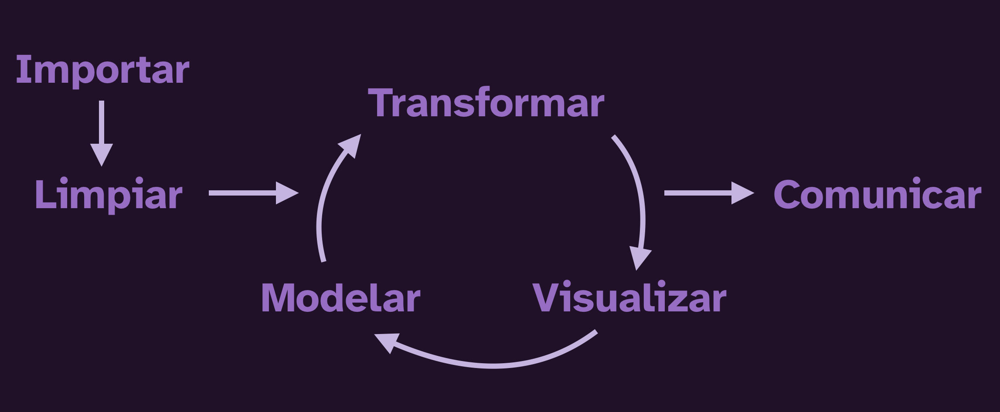
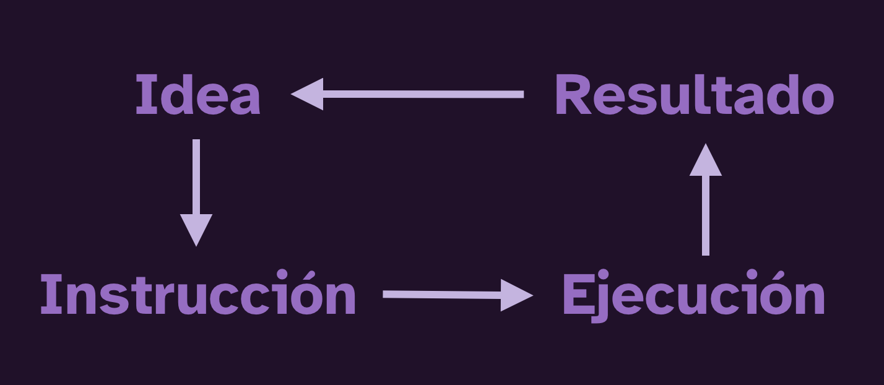
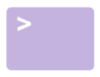
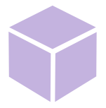
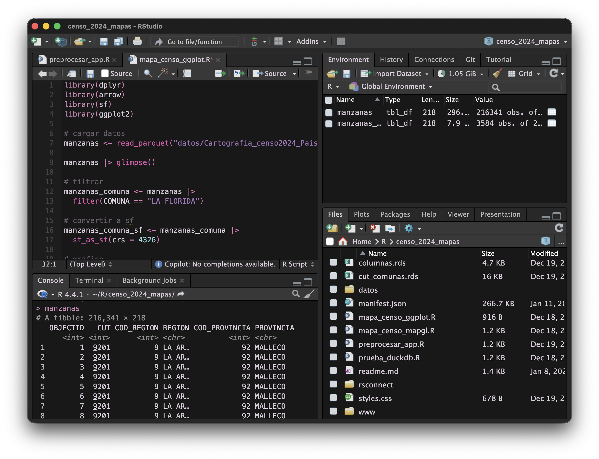
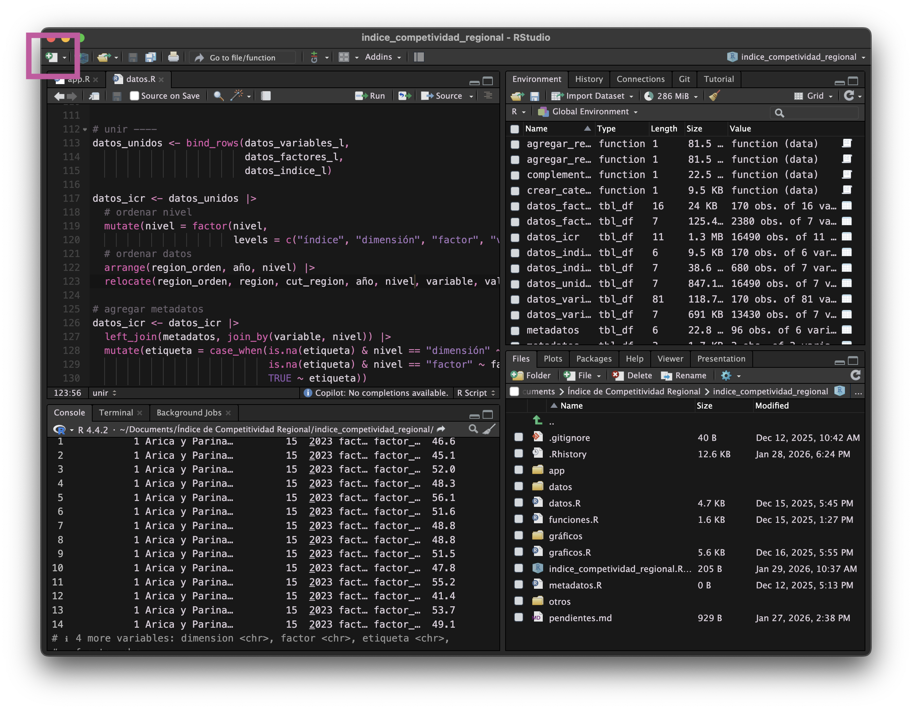
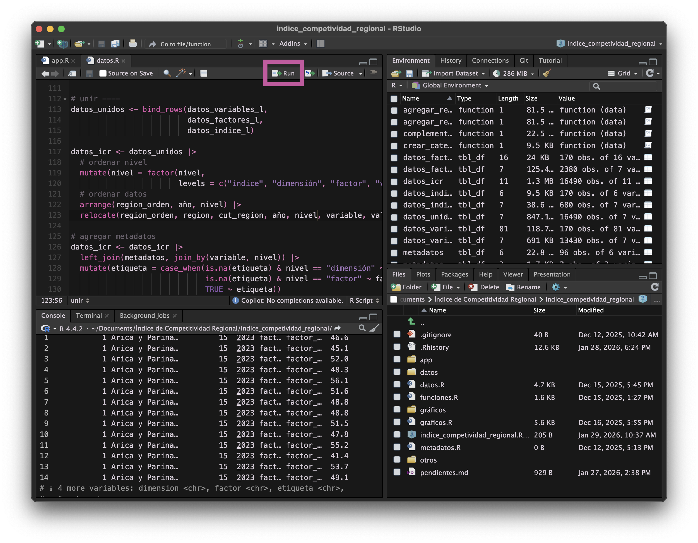
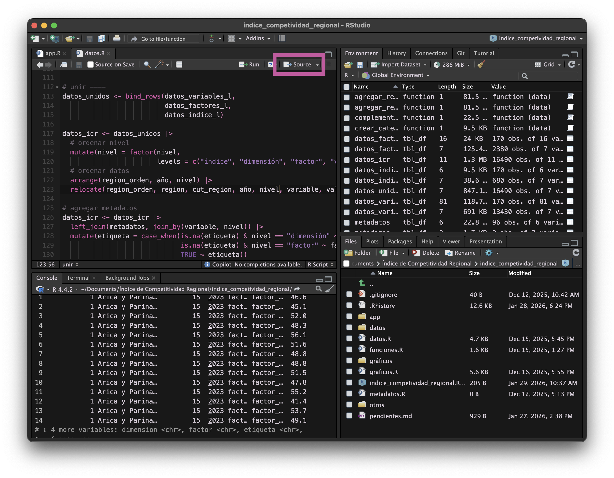
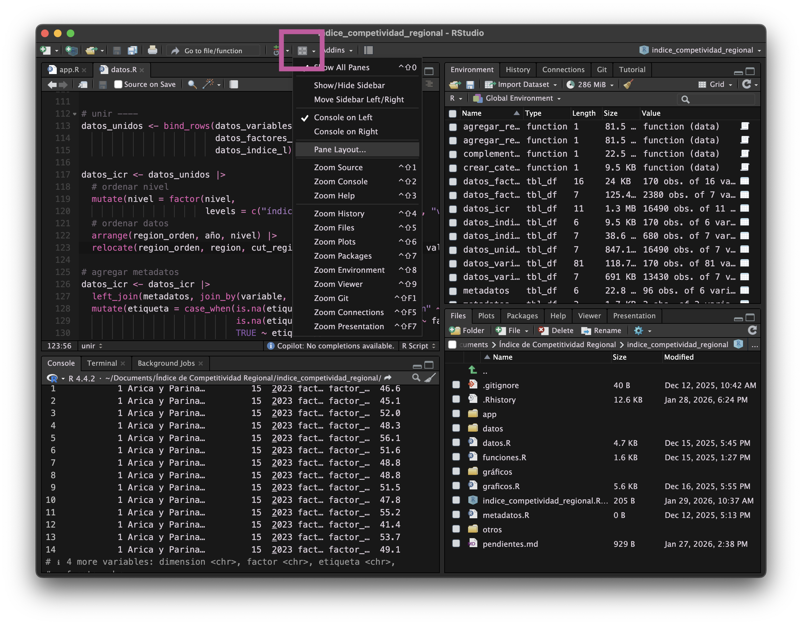
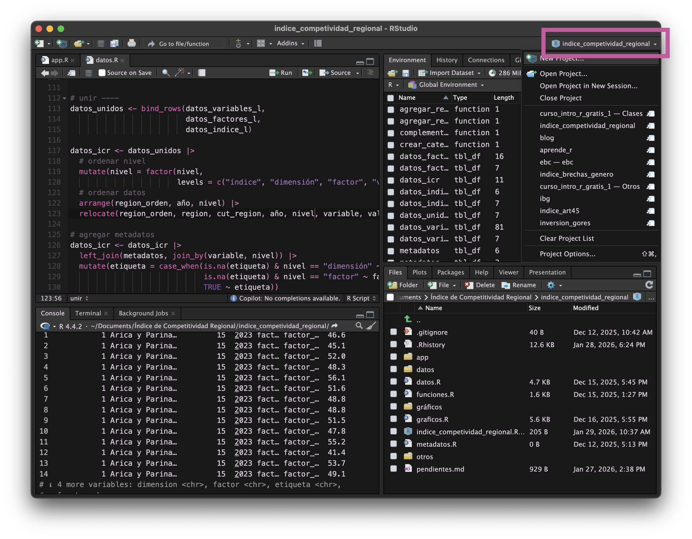

## Objetivo del taller

El objetivo de este taller es introducir a l@s participantes en el **lenguaje de programación R** y su uso para el **análisis de datos en ciencias sociales**, usando como ejemplo la Encuesta ICSOH-UDP.

Para ello, vamos a aprender a:
- Que es R y RStudio
- Introducción al lenguaje de programación R
- Herramientas basicas para el procesamiento de datos
- Herramientas basicas para el analisis descriptivo de datos 

Que no vamos a ver:
- Como instalar R y Rstudio (consultar guia)
- Funciones, loops, y otras extensiones
- Analisis estadisticos complejos (modelos)

Detalles de la encuesta ICSOH-UDP

Metodología
Encuesta Web, programada para ser
respondida en formato autoaplicado
sobre panel de Ipsos. Muestreo no
probabilístico en base a cuotas que
representen la dispersión regional de
Chile.
Tamaño de muestra
n = 1.500 casos efectivos.
 para mas informacion consultarhttps://icso.udp.cl/nosotros/encuesta/


----

### Flujo de trabajo

::: {.fragment}
{.centro style="width: 800px;"}
:::

::: {.fragment}
{.centro style="width: 540px;"}
:::

----

## ¿Qué es R?

:::: {.columns}

::: {.column width="55%"}
R es un lenguaje de programación enfocado al **análisis de datos**, las **estadísticas** y la **visualización de datos**.
:::

::: {.column width="45%"}
{.rosa style="height: 180px; margin-top:-30px;"}
:::
::::

::: {.boton style="margin-top:-20px; margin-bottom:-30px;"}
[ Descargar R](https://cran.r-project.org/)
:::

<br>

:::: {.fragment}
### ¿Para qué sirve?

::: {.incremental}
- Para procesar, limpiar, y analizar datos
- Crear gráficos, tablas, mapas, y otros resultados visuales
- Repetir, mejorar, adaptar y reutilizar lo que ya has hecho ♻️
- Automatizar tareas repetitivas 🤖
- Expandir tus resultados con aplicaciones, sitios web, APIs, y más 🚀
:::
::::

----


### ¿Por qué usar R?

:::: {.fragment}
::: {.cuadro} 
[Gratuito]{.subtitulo}

R es un lenguaje de programación abierto y gratuito, mantenido por su propia comunidad de usuari@s. Al ser _software libre_, nunca tendrás que pagar nada!
:::
::::

:::: {.fragment}
::: {.cuadro} 
[Amigable]{.subtitulo}

R fue diseñado para el análisis de datos, y fue creado por y para personas de diversas disciplinas. Esto lo vuelve en la herramienta apropiada para trabajar con datos, más amigable e intuitivo que otros lenguajes.
:::
::::

:::: {.fragment}
::: {.cuadro} 
[Reproducible]{.subtitulo}

La gracia de R es registrar todos los pasos de tu análisis, lo que facilita corregirlos, mejorarlos, reutilizarlos para nuevos casos, y compartirlos con otros.
:::
::::

----


## ¿Qué se puede hacer con R?


<div style="text-align: center; font-size: 90%;">
Muestra de algunas [aplicaciones](https://bastianolea.github.io/shiny_apps/), [gráficos](https://bastianolea.rbind.io/tags/gráficos/), [tablas](https://bastianolea.rbind.io/tags/tablas/), y [mapas](https://bastianolea.rbind.io/tags/mapas/) hechos con R. También algunos [trabajos](https://bastianolea.rbind.io/blog/portafolio_trabajos_r/) que he hecho.
</div>


# RStudio

::::: {.columns}

:::: {.column width="55%"}

RStudio es una IDE (entorno de desarrollo integrado) que nos permite escribir código en R de forma más cómoda, organizada, y visual.

::: {.incremental}
- Es la forma más popular de usar R
- Lanzado en 2011
- Software libre (licencia de código abierto AGPL)
- También existen alternativas, como [Positron](https://positron.posit.co)
:::

::: {.boton .fragment}
[ Descargar RStudio](https://posit.co/download/rstudio-desktop/)
:::

::::

:::: {.column width="45%"}
{.rosa style="height: 200px; margin-top:-36px;"}
::::

:::::


----


## Conceptos clave

<br>

::: {.fragment}
{.izq style="margin: 10px; width: 110px;"}

#### Script

Archivo de texto .R en el que escribimos nuestro código, en pasos, y siguiendo un orden lógico.

<br>
:::

::: {.fragment}
{.izq style="margin-top: 10px; width: 130px;"}

#### Consola

Es la forma directa de interactuar con R, un comando a la vez, con resultados efímeros.

<br>
:::

::: {.fragment}
{.izq style="width: 130px;"}

#### Proyecto

Archivo .Rproj que marca nuestro espacio de trabajo: una carpeta específica que reúne todas las piezas de nuestro análisis.
:::


----


## Paneles de RStudio

::: {.boton .absolute top=-1% right=0%}
[ Descargar RStudio](https://posit.co/download/rstudio-desktop/)
:::

{.entrada-fade-in .centro style="width: 800px;"}

::: {.fragment}
[1]{.circulo-grande .absolute top=30% left=4%}
[Scripts]{.circulo-grande-texto .absolute top=30% left=4%}
:::

::: {.fragment}
[2]{.circulo-grande .absolute top=70% left=4%}
[Consola]{.circulo-grande-texto .absolute top=70% left=4%}
:::

::: {.fragment}
[3]{.circulo-grande .absolute top=30% right=4%}
[Entorno]{.circulo-grande-texto-der .absolute top=30% right=4%}
:::

::: {.fragment}
[4]{.circulo-grande .absolute top=70% right=4%}
[Archivos]{.circulo-grande-texto-der .absolute top=70% right=4%}
:::

----


### Consola y scripts

{.absolute top=5% right=-20%}

:::: {.columns}

::: {.column}

::: {.incremental}
- Todos los **comandos** se ejecutan por medio de la **consola** (abajo), que es donde vive R
- Al ejecutar código en la consola, el código no se guarda, sólo se ejecuta!
- Para **guardar** el código, escribimos en **scripts** (arriba)
- Escribimos el código en un script (arriba), y cuando se lo pidamos (botón _Run_ o `control` + `enter`), RStudio se encarga de **ejecutar** el código en la consola (abajo)
:::

:::
::::


----

### Botones 

::::{.r-stack}

::: {.fragment .fondo}
{style="width: 700px;"}

::: {.centrar}
Crear un **nuevo script** de R
:::
:::


::: {.fragment .fondo}
{style="width: 700px;"}

::: {.centrar}
Botón para **ejecutar código**
:::
:::

::: {.fragment .fondo}
{style="width: 700px;"}

::: {.centrar}
Botón para **ejecutar todo el script**
:::
:::

::: {.fragment .fondo}
{style="width: 700px;"}

::: {.centrar}
Configurar paneles de RStudio
:::
:::

::: {.fragment .fondo}
{style="width: 700px;"}

::: {.centrar}
Cambiar de **proyecto** o crear uno nuevo
:::
:::

::::


----


# Introducción a R


::::: {.columns}

:::: {.column width="55%"}

Veamos ahora los **elementos más básicos** del lenguaje R, para luego avanzar a su aplicación al **análisis de datos**.

::: {.boton .fragment}
[ Guía de aprendizaje](https://bastianolea.github.io/aprende_r/#basico)
:::

::::

:::: {.column width="45%"}
{.rosa style="height: 200px; margin-top:-36px;"}
::::

:::::


----


## R como calculadora

::: {.boton .absolute top=0% right=0%}
[ Ver tutorial](https://bastianolea.rbind.io/blog/r_introduccion/r_basico/#primeras-operaciones-en-r)
:::


::::: {.columns}

:::: {.column style="padding-right:28px;"}

::: {.incremental}
- Podemos realizar cualquier operación matemática en R.
- Para **ejecutar** un comando, pon el cursor de texto en la línea que desees ejecutar, o selecciónala, y presiona el botón _Run_, o las teclas `control + enter`.
- Lo importante es que el cursor de texto `|` esté en cualquier lugar de la **línea**.
- El **resultado** siempre aparecerá en la **consola**.
:::

::::

:::: {.column width="40%"}

::: {.fragment} 

<br>


```{r}
#| code-line-numbers: false
2 + 2 #suma
```

```{r}
#| code-line-numbers: false
50 * 100 #multiplicación
```

```{r}
#| code-line-numbers: false
4556 - 1000 #resta
```

```{r}
#| code-line-numbers: false
6565 / 89 #división
```

```{r}
#| code-line-numbers: false
10^4 #potencias
```

:::

::::
:::::


----

### Comentarios

::: {.incremental}
- Si ejecutamos operaciones que son son válidas, obtenemos un **error**!
- Los comentarios nos permiten poner texto en cualquier parte del script sin que afecte los cálculos.
- También podemos poner un comentario al final de una línea sin que afecte el código
- Usa los comentarios para describir lo que buscas hacer con el código
:::


::: {.fragment}
```{r}
#| eval: false

# sumar 4 números
1 + 1 + 1 + 1
# quizás esto debería
# ser de otra forma, porque
# la verdad quedó bien mal...

1 * 4 # así queda mucho mejor
```
:::

----

## Operaciones logicas

¡Veamos algunos ejemplos!

20 == 5 # igualdad

[1] FALSE

30 >= 14 # mayor o igual que

[1] TRUE

22 <= 2 # menor o igual que

[1] FALSE

25 != 10 # no es igual a

[1] TRUE

p = 10; y = 5; p <= y # operatoria en objetos

[1] FALSE


## Tipos de datos

Lo que podemos hacer siempre va a depender del **tipo** de cada objeto. 

. . .

En R existen varios tipos:

::: {.pad}
**Numéricos**
```{r}
#| eval: false
#| code-line-numbers: false
1  2  3  4  5.1  5.2  5.333
```
Pueden ser decimales (_doubles_) o enteros (_integers_)
::: 

. . .

::: {.pad}
**Caracter** (texto)
```{r}
#| eval: false
#| code-line-numbers: false
"ésta es una cadena de texto"
```
::: 

. . .

::: {.pad}
**Lógicos** (verdadero o falso)
```{r}
#| eval: false
#| code-line-numbers: false
TRUE FALSE TRUE
```
::: 


----

## Objetos

Hasta ahora hemos trabajado con datos sueltos. Si queremos volver a usar un dato o resultado, debemos guardarlo en un **objeto**.

Se le llama **objeto** a cualquier dato, variable, o elemento que **guardemos** en R.

. . . 

Para **crear** un objeto, simplemente le damos un nombre y le _asignamos_ un valor o contenido.

::: {style="max-width: 300px; margin: auto;"}
**nombre** [←]{style="font-size: 130%;"} _contenido_
:::

<br>

. . . 

:::: {.columns}
::: {.column .just-der }
Para asignar algo a un objeto, usamos el operador `<-`
:::

::: {.column}
```{r style="margin-left: 28px; margin-top:20px;"}
#| code-line-numbers: false
numerito <- 4
```
:::
::::

<br>

. . . 

:::: {.columns}
::: {.column .just-der}
El objeto `numerito` se **crea** cuando declaramos que va a contener el **valor** `4`, y luego podemos ejecutar `numerito` para obtener su contenido (`4`)
:::

::: {.column}
```{r style="margin-left: 28px; margin-top:20px;"}
#| code-line-numbers: false
numerito
```
:::
::::


----

### Asignación

::: {.boton .absolute top=0% right=0%}
[ Ver tutorial](https://bastianolea.rbind.io/blog/r_introduccion/r_basico/#asignaciones)
:::


Con el _operador de **asignación**_ creamos objetos nuevos.

::: {.centrar style="font-size: 200%"}
`<-`
:::

::: {.fragment}
Se escribe con: 

::: {.centrar style="color: #563A74; opacity: 40%;"}
Windows:
:::

{.centrar}

::: {.centrar style="color: #563A74; opacity: 40%; margin-top:32px;"}
Mac:
:::

{.centrar}

:::

----


:::: {.columns}

::: {.column}
Al asignar algo, **creamos** o **modificamos** un objeto con el valor que le estamos asignando.

Al ejecutar un objeto, obtenemos su valor.
:::

::: {.column}

::: {.fragment}
```{r}
edad <- 32
edad
```
:::

::: {.fragment}
```{r}
animal = "gato"
animal
```
:::

:::
::::

<br>

::: {.fragment}
:::: {.columns}

::: {.column width=40%}

<div style="padding-right:12px;">
Podemos usar el objeto creado para lo que queramos.

Crear objetos es como **asignar variables**, y podemos usar estas variables para llevar a cabo operaciones!
</div>

:::

::: {.column width=60%}


:::: {.columns}

::: {.fragment .column width=49%}
```{r}
edad <- 32
año <- 2026
año - edad
```
:::

::: {.fragment .column width=49%}
```{r}
perros = 2
gatos = 3
perros + gatos
```
:::
::::

::: {.fragment}
```{r}
presupuesto = 100000
pizza = 15000
presupuesto - pizza * 10
```
:::
:::
::::

:::

----


## Vectores

Los vectores son **secuencias** de elementos. Un objeto que contiene cero o más datos.

::: {.incremental}
- Estos elementos son de un **mismo tipo**: numérico, carácter o lógico.
- Son la forma más básica de registrar e interactuar con varios datos a la vez.
:::

::: {.fragment}
```{r}
c(1, 2, 3, 4, 5, 6)
c("a", "b", "c", "d")
c(TRUE, FALSE, FALSE)
c(0.2, 0.1, -0.0, -0.1)
```
:::

----

### Operaciones sobre vectores

Podemos realizar cualquier **operación** sobre los elementos de un vector:
```{r}
año <- 2026
edades <- c(54, 34, 65, 21, 32)
año - edades
```


----


## Funciones

::: {.incremental}
- Las **funciones** son pequeños programas que permiten realizar distintas operaciones.
:::

::: {.centrar .fragment}
`función(argumento = 123)`
:::

::: {.fragment}
Algunas funciones comunes:

```{r}
#| code-line-numbers: false
#| eval: false
mean() # calcular promedio
median() # calcular mediana
sum() # sumar elementos
min() # valor mínimo
max() # valor máximo
```
:::

::: {.fragment}
Por ejemplo:

```{r}
mean(c(1, 2, 3, 4, 5))
```
:::

:::: aside
::: {.fragment}
Si no sabemos cómo usar una función, podemos buscar su nombre en el panel **Ayuda** de RStudio, o escribir el nombre de la función precedido de un signo de interrogación: `?funcion`
:::
::::

----

Un lenguaje orientado a objetos

R es un lenguaje de programación orientado a objetos. ¿Qué significa eso?, implica que podemos crear elementos dentro del ambiente de R, a los cuales les asignaremos información que quedará almacenada, información que puede ir desde números, palabras, cálculos hasta grandes bases de datos.

Todas las instrucciones en R en las que crees objetos, es decir, instrucciones de asignación, tendrán la misma estructura:

nombre_objeto <- valor

El asignador <- se utiliza para crear objetos y forma parte de uno de los operadores usados en R.

Los elementos que podemos asignar a objetos son múltiples, como números, palabras acompañadas siempre de corchetes " " y vectores que corresponden a un conjunto o secuencia de elementos del mismo tipo definidos por la funcion de concatenar = c().

Veamos un ejemplo creando objetos:

x <- 4 # asignar

x # ejecutar

[1] 4

y <- "Hola mundo" # los carácteres alfabéticos siempre van acompañados de corchetes

y 

[1] "Hola mundo"

¿Y concatenando? Hacemos un vector.

edad <- c(18,22,36,19,35) # concatenar (variable de razon)

edad

[1] 18 22 36 19 35

genero <- c(3,1,1,2,3) # masculino = 1; femenino = 2; transgenero = 3 (variable nominal)

genero 

[1] 3 1 1 2 3

gse <- c("ABC1", "C2", "E", "AbC1", "E")  # tambíen se pueden usar carácteres (variable ordinal)

gse

[1] "ABC1" "C2"   "E"    "AbC1" "E"   

¡Hagamos una pequeño reto!: ¿Cuál es el valor de a y b? Si a <- 5; b <- a; a <- 4

a <- 5
b <- a
a <- 4

print(a) # imprimir en la consola

[1] 4

print(b)

[1] 5

a + 10

[1] 14

Ahora, sea z = a^2 ¿qué resultado obtenemos de a * b + z?

z <- a^2 # asignar

a * b + z

[1] 36

Además de lo anterior, en R es fundamental la creación de data.frames. Un Data.frame es una estructura de datos de dos dimensiones (columnas y filas), donde las columnas pueden ser de diferente naturaleza, pero deben tener el mismo largo. A partir de ella agrupamos variables en una matriz, o sea, construimos una base de datos. Es como “pegar” las columnas (variables) una al lado de otra.

Creemos un data.frame con los vectores que ya creamos antes.

base1 <- data.frame(genero, gse, edad) # Resulta como objeto de "datos" en
                                       # entorno.

base1

  genero  gse edad
1      3 ABC1   18
2      1   C2   22
3      1    E   36
4      2 AbC1   19
5      3    E   35

Como puedes ver, para crear el data.frame usamos la función que lleva el mismo nombre, colocando dentro del paréntesis los vectores que creamos anteriormente: data.frame(mis_vectores).

Ahora, creemos un data.frame desce cero. En este ejemplo, crearemos los vectores dentro de la función data.frame().

# Ejemplo de como crear un data.frame desde 0: 

base2 <- data.frame(Sexo=c("H","M","H","M","H","M"),
                    Estatura=c(1.83,1.76,1.82,1.60,1.90,1.66),
                    Peso=c(67,58,66,48,75,55))

head(base2)  # Me permite visualizar las primeras filas

  Sexo Estatura Peso
1    H     1.83   67
2    M     1.76   58
3    H     1.82   66
4    M     1.60   48
5    H     1.90   75
6    M     1.66   55

-----

# Herramientas basicas de procesamiento de datos

- Paquetes
- Cargar datos
- Observar datos
- Estructura de la bbdd
- Manipular datos
    - Seleccionar
    - Renombrarx
    - Filtrar
    - Recodificar y transformar
    - Valores perdidos
- Guardar y exportar

Herramientas para analizar datos

- Resumiendo datos
- Variables categoricas
- Variables numericas
- Bivariados
- Algunos graficos

## Paquetes

:::: {.columns} 

::: {.fragment .column width=60%}

:::

::: {.column width=40%}

::: {.incremental}
- **Extensiones** de R que te permiten agregar **nuevas funciones** al lenguaje, **datos**, y más.
- Se instalan desde internet
- Son creados y mantenidos **por la comunidad**
- Se revisan para garantizar su seguridad y estabilidad
:::

::: {.fragment}
```{r}
#| eval: false
#| code-line-numbers: false
install.packages()
```
:::

:::

::::


# Datos 

Para cargar datos, tenemos que:

::: {.incremental}
- Tener un **archivo** y conocer su **formato** (Excel, Stata, CSV, etc.)
- [Saber **dónde está** el archivo en nuestro computador]{.fragment .strike}
- **Guardar** el archivo dentro del proyecto de R 📂
- Conocer una **función** y posiblemente un **paquete** que lea ese formato de archivos
:::

## Cargar datos 

- Las funciones de carga de datos usan como argumento la **ruta** del archivo.

::: {.fragment .pad}
Cargar un archivo en la misma carperta del proyecto:
```{r}
#| eval: false
#| code-line-numbers: false
datos <- read.csv("datos.csv")
```
:::

::: {.fragment .pad}
Cargar un archivo en una subcarpeta del proyecto:
```{r}
#| eval: false
#| code-line-numbers: false
datos <- read.csv("carpeta/datos.csv")
```
:::

----

### Paquetes para carga de datos 

{.pad style="height: 200px;"}


::: {.pad .incremental}
- `{readxl}` es uno de los paquetes de lectura de planillas Excel. Para escribir un archivo Excel está `{writexl}`
- `{readr}` lee y escribe datos de múltiples formatos (csv, rds, rdata), usualmente de forma más veloz y cómoda
- `{haven}` permite cargar archivos SPSS, Stata, y SAS
- `{arrow}` es un formato moderno de datos columnares, optimizado para grandes volúmenes y velocidad de carga, y pensado para usarse en distintos softwares
:::

----

### Carga de datos desde Excel

Probemos cargando unos datos!

::: {.boton}
<a href="https://github.com/bastianolea/curso_intro_R_3/raw/master/datos/pobreza/estimaciones_pobreza.xlsx" target="_blank">  Descargar datos de pobreza en Excel</a>
:::

:::  {.fragment}
Cargamos los datos usando una función del paquete `{readxl}`:


```{r cargar_excel}
# cargar paquete
library(readxl) 

# cargar datos
datos <- read_excel("estimaciones_pobreza.xlsx")

# mirar datos
head(datos)
```

:::


# `{dplyr}`


:::: {.columns}
::: {.incremental .column width=70%}
- Paquete de exploración, manipulación y transformación de datos
- Sus funciones se escriben como verbos
- Las acciones se encadenan con el operador de conexión o _pipe_: `|>`

::: {.fragment}
```{r}
#| message: false
# install.packages("dplyr")
library(dplyr)
```
:::
:::

::: {.column width=30%}
{}
:::
::::

<br>

::: {.boton .fragment}
[ Ver tutorial](https://bastianolea.rbind.io/blog/r_introduccion/dplyr_intro/)
:::


----

## ¿Para qué sirve `{dplyr}`?

Para **explorar** y **modificar** los datos.

:::: {.columns}

::: {.column}
**Seleccionar columnas:**
```r
datos |> select(region, comuna, porcentaje)
```

```{r}
#| echo: false
datos |> select(region, comuna, porcentaje) |> head(n = 4)
```


**Ordenar observaciones:**
```r
datos |> arrange(porcentaje)
```

```{r}
#| echo: false
datos |> select(region, comuna, porcentaje) |> arrange(porcentaje) |> head(n = 4)
```

:::

::: {.column}

**Filtrar datos:**
```r
datos |> filter(porcentaje > 0.3)
```

```{r}
#| echo: false
datos |> select(region, comuna, porcentaje) |> filter(porcentaje > 0.3) |> head(n = 4)
```

**Crear variables:**
```r
datos |> mutate(ranking = row_number())
```

```{r}
#| echo: false
datos |> select(comuna, porcentaje) |> arrange(desc(porcentaje)) |> mutate(ranking = row_number()) |> head(n = 4)
```

Y más!

:::
::::

----


## Conector

::: {.boton .absolute top=0% right=0%}
[ Ver tutorial](https://bastianolea.rbind.io/blog/r_introduccion/conectores/)
:::

El conector o _pipe_ `|>` (o también `%>%`) nos permite encadenar varias funciones de forma más legible.

::: {.centrar style="font-size: 200%"}
`|>` o `%>%`
:::

::: {.fragment}
Se escribe con: 

::: {.centrar style="color: #563A74; opacity: 40%;"}
Windows:
:::

{.centrar}

::: {.centrar style="color: #563A74; opacity: 40%; margin-top:32px;"}
Mac:
:::

{.centrar}

:::


----


## Seleccionar y ordenar

::: {.boton .absolute top=-1% right=0%}
[ Ver tutorial](https://bastianolea.rbind.io/blog/r_introduccion/dplyr_intro/#datos)
:::

Usaremos los datos de **pobreza** del [Ministerio Desarrollo Social y Familia](https://bidat.gob.cl/directorio/Pobreza%20comunal/estimaciones-de-pobreza-comunal-2022) que vimos antes. Si no los cargaste, [descárgalos](https://github.com/bastianolea/curso_intro_R_3/raw/master/datos/pobreza/estimaciones_pobreza.xlsx) y los cargas así:

```{r}
library(dplyr)
library(readxl)

datos <- read_excel("estimaciones_pobreza.xlsx")
```

<br>


:::: {.columns}

::: {.column .fragment}
#### Seleccionar
```{r}
datos |> 
  select(region, comuna, personas) |> 
  head()
```
::: 

::: {.column .fragment}
#### Ordenar
```{r}
datos |> 
  select(region, comuna, personas) |> 
  arrange(desc(personas)) |> 
  head()
```
:::
::::


----

### ¿Qué estamos haciendo?

Al aplicar una función sobre un _dataframe,_ por ejemplo, `select()` para seleccionar columnas, **no estamos modificando los datos**, sino que estamos **trabajando con una copia** de los datos para no afectar los datos originales.

Todo lo que hagamos con `{dplyr}` serán **pruebas** y **exploración** de los datos, hasta que **decidamos** que los cambios que hagamos deben guardarse, así que entonces los **asignamos** a un **objeto nuevo**.

```{r}
#| eval: false

# prueba sin consecuencias
datos |> 
  select(comuna, personas)

# creamos un nuevo objeto a partir de los datos originales
datos_filtrados <- datos |> 
  select(comuna, personas)
```

Como asignamos los resultados a un **objeto nuevo**, tampoco estamos modificando ni afectando los datos originales. Así mantenemos un proceso **reproducible!**

----


## Filtrar datos

::: {.boton .absolute top=-1% right=0%}
[ Ver tutorial](https://bastianolea.rbind.io/blog/r_introduccion/dplyr_intro/#filtrar-datos)
:::

- Para filtrar, realizamos una **comparación** entre los valores de una columna y un valor específico.


::: {.fragment}
```{r}
#| message: false
library(dplyr)

datos |> 
  filter(porcentaje > 0.35) |> 
  arrange(desc(porcentaje)) |> 
  head()
```
:::


----


## Funciones comunes

Algunas de las funciones más comunes de usar en `{dplyr}`, que son también las que usaremos para interactuar con los datos.

::: {.incremental}
- `head()`, `tail()`, `glimpse()`: vistazos a los datos
- `select()`: seleccionar columnas o variables de una tabla
- `slice()`: extraer filas de una tabla por su posición o distintos criterios
- `pull()`: extraer una columna como vector
- `filter()`: filtrar observaciones en base a condiciones personalizadas
- `distinct()`: filtrar observaciones repetidas en una o más columnas
- `count()`: conteo de casos únicos en una o más columnas
- `mutate()`: crear columnas entregando valores, funciones sobre columnas, o calculando a partir de otras columnas
:::

----


## Datos de texto 

{.esquina-der style='height:128px;'}

El paquete `{stringr}` se especializa en texto.

::: {.pad}
```{r}
library(stringr)
```

::: {.fragment}
```{r}
texto <- "todxs pueden aprender a programar 💕" 

str_detect(texto, "todos")

str_detect(texto, "aprender")
```
:::

::: {.fragment}
```{r}
datos |> 
  filter(str_detect(comuna, "Alto")) |> 
  select(region, comuna)
```
:::
:::


----


## Crear/modificar variables

::: {.boton .absolute top=0% right=0%}
[ Ver tutorial](https://bastianolea.rbind.io/blog/r_introduccion/dplyr_mutate/)
:::

::: {.pad}
Con `mutate()` para crear una nueva variable o columna
:::

::: {.pad}
Le aplicamos `mutate()` a un _data frame_ conectando los datos a la función con un conector (`|>` o `%>%`)
:::

:::: {.columns}
::: {.column .fragment}
```{r}
datos |> 
  select(codigo, comuna) |> 
  mutate(saludo = "hola") |> 
  head()
```
:::

::: {.column .fragment}
```{r}
datos |> 
  select(comuna, personas) |> 
  mutate(miles = personas/1000) |> 
  head()
```
:::
::::

----


### Aplicar funciones a columnas

::: {.boton .absolute top=-2% right=0%}
[ Ver tutorial](https://bastianolea.rbind.io/blog/r_introduccion/dplyr_mutate/)
:::

::: {.fragment}
Las funciones realizan operaciones sobre todos los datos de una columna, **reemplazando** los datos existentes, o **rellenando** datos de una columna nueva.
:::

::: {.fragment}
Dependiendo de lo que queramos hacer, las funciones que apliquemos con `mutate()` pueden hacer referencia a **una o a varias** columnas:
:::

::: {.fragment}
```{r}
datos |>
  select(comuna, personas) |> 
  arrange(desc(personas)) |> 
  head() |> 
  mutate(total_personas = sum(personas)) |> # aplicada a una columna
  mutate(letras = nchar(comuna)) |> # aplicada a otra columna
  mutate(orden = row_number()) |> # hace algo por sí misma
  mutate(porcentaje = round(personas/total_personas, 2)) # función con argumento
```
:::


----

### Variables condicionales


::: {.boton .absolute top=0% right=0%}
[ Ver tutorial](https://bastianolea.rbind.io/blog/r_introduccion/dplyr_mutate/#crear-una-variable-condicional-con-if_else)
:::

:::: {.columns}
::: {.column .fragment}
#### `ifelse()`

**Si** ocurre _esto,_ **entonces** retorno _lo primero_, y **si no**, _lo segundo._
```{r}
datos |> 
  select(comuna, porcentaje) |> 
  mutate(nivel = ifelse(
    porcentaje >= 0.3,
    yes = "alta", 
    no = "baja")) |> 
  head()
```
:::

::: {.column .fragment}
#### `case_when()`
Recodificación avanzada con **múltiples condicionales**.
```{r}
datos |> 
  select(comuna, porcentaje) |> 
  mutate(miles = case_when(
    porcentaje >= 0.3 ~ "alta",
    porcentaje >= 0.2 ~ "media",
    porcentaje < 0.2 ~ "baja")) |> 
  head()
```
:::
::::


----


## Resúmenes de datos

::: {.boton .absolute top=-1% right=0%}
[ Ver tutorial](https://bastianolea.rbind.io/blog/r_introduccion/dplyr_summarize/)
:::

::: {.fragment}
Aplicar una **función** para **resumir** todas las filas de una tabla en un sólo resultado:

```{r}
datos |> 
  summarize(total = sum(personas))
```
:::

::: {.fragment}
Si **agrupamos** los datos, obtendremos una fila de resultado por cada grupo:

```{r}
datos |> 
  group_by(region) |> 
  summarize(total = sum(personas)) |> 
  head(n = 4)
```
:::

----

### Resumiendo datos

Veamos los [datos de educación del **Censo 2024**](https://censo2024.ine.gob.cl/resultados/), que contienen la escolaridad promedio de cada comuna, por sexo.

::: {.boton}
<a href="https://github.com/bastianolea/curso_intro_R_3/raw/master/datos/censo/educacion.xlsx" target="_blank">  Descargar datos de educación en Excel</a>
:::

```{r}
educacion <- readxl::read_xlsx("educacion.xlsx")

educacion |> 
  filter(region != "País") |> 
  filter(sexo == "Total Comuna") |> 
  group_by(region) |> 
  summarize(escolaridad = mean(escolaridad),
            escolaridad_mayores_edad = mean(escolaridad_mayores_edad),
            n_comunas = n()) |> 
  head(n = 4)
```


----


## Recursos de aprendizaje


::: {.boton}
[ Tutorial de visualización de datos con `{ggplot2}`](https://bastianolea.rbind.io/blog/r_introduccion/tutorial_visualizacion_ggplot/)
:::

- [R Graph Gallery](https://www.r-graph-gallery.com/)
- [R Charts](https://r-charts.com/es/)
- [A ggplot2 Tutorial for Beautiful Plotting in R](https://cedricscherer.netlify.app/2019/08/05/a-ggplot2-tutorial-for-beautiful-plotting-in-r/), tutorial de `{ggplot2}` en inglés


## Datos para practicar 


::: {.boton}
[ Estimaciones de población Censo](https://raw.githubusercontent.com/bastianolea/curso_intro_R_3/refs/heads/main/datos/estimaciones/estimaciones-y-proyecciones-base.xlsx)
:::


::: {.boton }
[ Variables educacionales Censo 2024](https://github.com/bastianolea/curso_intro_R_3/raw/master/datos/censo/P7_Educacion.xlsx)
:::

::: {.boton }
[ Estimación de pobreza multidimensional 2022](https://github.com/bastianolea/curso_intro_R_3/raw/master/datos/pobreza/estimaciones_indice_pobreza_multidimensional_comunas_2022.xlsx)
:::

::: {.boton }
[ Clasificaciones comunales 2024](https://github.com/bastianolea/curso_intro_R_3/raw/master/datos/clasificacion/ClasificacionComunasPNDR_Censo2024.xlsx)
:::

Puedes encontrar más datos en mi [repositorio de datos sociales](https://bastianolea.github.io/datos_sociales/), en el [banco integrado de datos del Ministerio de Desarrollo](https://bidat.midesof.cl/), en los [datos abiertos del Estado Chile](https://datos.gob.cl/), y [muchos más](https://bastianolea.rbind.io/blog/r_introduccion/recursos_r/#datos).

:::: aside 
::: {.fragment}
Ahora que ya sabes lo básico, todo lo demás se trata de aprender piezas y herramientas que puedes ir agregando a tus análisis! 🧩🛠️
:::
::::


----

## Consejos 

::: {.incremental}
- Mantengan su propio **libro de aprendizajes** 📝
- Lean bien los **errores** y busquen su significado
- Si algo sale mal, prueben **paso a paso** 
- También pueden devolverse y **empezar de nuevo**
- Dense una vuelta y a veces la respuesta llega solita 😌
- No se vuelvan dependientes de la IA 😵
- Si quieren usar IA: 
- **Autocompletado** de GitHub Copilot
- **Mensaje de sistema** para su proveedor de IA
- Aprendendan a **buscar** bien en internet
- Compartan lo que hacen y socialicen sus aprendizajes! ✨
:::


# Gracias <span style="font-size: 110%; color: #9F69C7;">♥</span>


Puedes escribirme cualquier duda o comentario [por aquí](https://bastianolea.rbind.io/contacto/)

<br>


:::: {.centrar}
::: {.boton}
[ Aprende R](https://bastianolea.github.io/aprende_r/)
:::

::: {.boton}
[ Chat grupal](https://join.slack.com/t/aprende-r/shared_invite/zt-3u1bvfzf6-IenbDD_FfXqK6HnbxZdM2Q)
:::
::::

<br>

:::: {.centrar}
::: {.boton}
[ Curso](https://bastianolea.rbind.io/clases/curso_intro_R_3/)
:::

::: {.boton}
[ Código](https://github.com/bastianolea/curso_intro_R_3)
:::

::: {.boton}
[ Grabaciones](https://www.youtube.com/@bastianolea)
:::
::::

